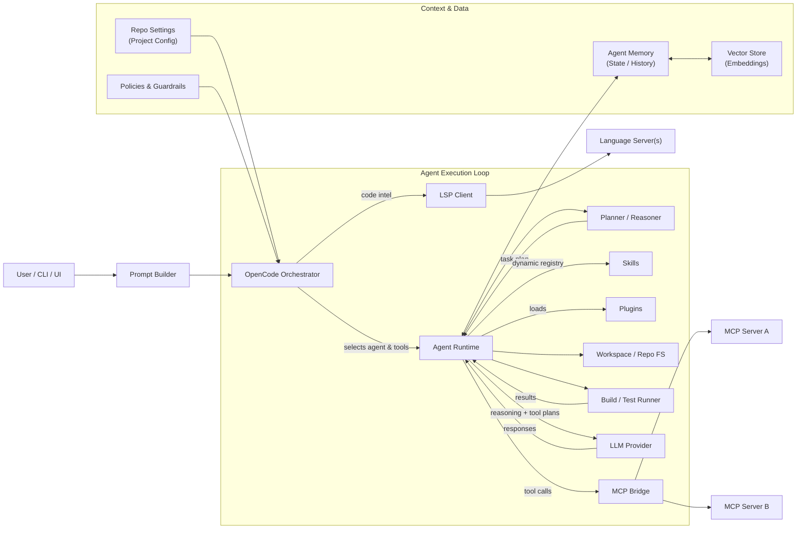

# AI Coding Agent Orchestration

> [!TIP]
> This document is meant for software engineers with various levels of experience with using AI while coding. This document explains why you should use an AI Coding Agent CLI followed by a complete guide for setting up an OpenCode AI coding environment with plugins, skills, and integrations. (Orchestration)

> [!IMPORTANT]
> Parts 1 and 2 are accessible to anyone interested in AI-assisted work.
> Part 3 of this document focuses on the tools that I currently use, Most instructions there are valid for every developer. 

> [!NOTE]
> This is an opiniated selection of tools and instructions based on my experience and preferences. There are many alternatives available, and the ecosystem is evolving rapidly. Feel free to explore and customize your setup as you see fit. If you have any questions or tips to share, please reach out by [creating an issue](https://github.com/evermeer/CodingAgentOrchestration/issues/) or contribute to the guide [with a PR](https://github.com/evermeer/CodingAgentOrchestration/pulls).

[MIT License](LICENSE)

---

## Table of Contents

- [Part 1: Why Use an AI Coding Agent CLI?](#part-1-why-use-an-ai-coding-agent-cli)
  - [The Evolution of AI-Assisted Coding](#the-evolution-of-ai-assisted-coding)
  - [The Agent Loop](#the-agent-loop)
  - [Context Is Everything](#context-is-everything)
  - [Why Not Just Use GitHub Copilot in VS?](#why-not-just-use-github-copilot-in-vs)
  - [Why OpenCode?](#why-opencode)
  - [The Landscape: Other CLIs and Autonomous Agents](#the-landscape-other-clis-and-autonomous-agents)
  - [How to Improve Your Agent's Results](#how-to-improve-your-agents-results)
  - [Other Options to Investigate](#other-options-to-investigate)
- [Part 2: A default setup](#part-2-a-default-setup)
  - [Prerequisites](#prerequisites)
  - [Step 1: Install the OpenCode CLI](#step-1-install-the-opencode-cli)
  - [Step 2: Install OpenCode Desktop](#step-2-install-opencode-desktop)
  - [Step 3: Extra power: Install and Configure Oh-My-OpenAgent](#step-3-extra-power-install-and-configure-oh-my-openagent)
  - [Step 4: Give your agent context.](#step-4-give-your-agent-context)
    - [Step 4.1 Standard Method](#step-41-standard-method)
    - [Step 4.2 Advanced knowledge tool for your repository or documents (partially alternative for Agents.md):](#step-42-advanced-knowledge-tool-for-your-repository-or-documents-partially-alternative-for-agentsmd)
    - [Step 4.3 AI Agent Session Memory](#step-43-ai-agent-session-memory)
  - [Step 5: Give your agent tools.](#step-5-give-your-agent-tools)
    - [Step 5.1 Reading various document formats.](#step-51-reading-various-document-formats)
    - [Step 5.2: Connect to Jira with the Jira MCP](#step-52-connect-to-jira-with-the-jira-mcp)
  - [Step 6: Give your agent skills](#step-6-give-your-agent-skills)
  - [Tips](#tips)
    - [for Daily Use](#for-daily-use)
    - [More Tips, but first install Advanced Use add-ons](#more-tips-but-first-install-advanced-use-add-ons)
- [Part 3: Advanced Use](#part-3-advanced-use)
  - [3.1 Install Software Engineering Skills](#31-install-software-engineering-skills)
  - [3.2. Install DevOps Skills, LSPs and MCPs](#32-install-devops-skills-lsps-and-mcps)
  - [3.3 Custom skills for refining and implementing jira stories](#33-custom-skills-for-refining-and-implementing-jira-stories)
  - [Keeping Things Up to Date](#keeping-things-up-to-date)

---

# Part 1: Why Use an AI Coding Agent CLI?

## The Evolution of AI-Assisted Coding

When getting familiar with AI-assisted coding you will probably go (or went) through the following phasesz, and at each step, your productivity improves:

1. **Chat interface online** — Just asking questions in a web chat. No code context.
2. **Code completion in your IDE** — Inline suggestions as you type (e.g. Copilot autocompletion).
3. **Ask from within your code** — Right-click, ask. Good for small, localized updates.
4. **IDE chat panel** — Refine your question while the AI knows context about your current file. Good for changes that focus on one file.
5. **AI Agent in IDE** — A Goal → Plan → Act → Reflect loop. Good at multi-file changes while continuously reflecting on what it's doing.
6. **AI Agent CLI / Desktop** — Same loop, but unconstrained by an IDE: can run terminal commands, drive multiple repos, work in parallel, and run long autonomous tasks. This is what the rest of this guide focuses on.

## The Agent Loop

An AI coding agent doesn't just answer questions — it operates in a continuous loop:


This loop is what separates an agent from a simple chat — it can plan work, execute it, and evaluate the result before continuing.

## Context Is Everything

The more context you give to LLM models the better the outcome will be. But giving them everything you have will give you extreme 
wait times plus costs. You have to solve this by optimising what you send to the LLM:

- **Behaviour context** — Let your agent select skills (or instruct it) to give it a behaviour / workmode context.
- **Content context** — Construct an agents.md or use a tool that creates a graph of your data to give it a content context.
- **External context** — Give your agent access to external systems (via MCP) to extend the content context.
- **Intent context** — Add an agent session memory tool to give it an intent context.

## Why Not Just Use GitHub Copilot in VS?

The Visual Studio GitHub Copilot agent is getting better and can now also use skills and MCP, but there are still some things where OpenCode (and other CLIs) excels.

**OpenCode (Desktop) benefits from:**
- terminal automation
- (multi-) repo-wide refactors
- autonomous, long-running workflows
- parallel execution of multiple agents/sessions
- swapping between LLM providers per task
- a richer add-on ecosystem (skills, plugins, MCPs) that you fully control

A realistic setup is to use **both**: GitHub Copilot in your IDE for tight inline edits, and OpenCode for everything broader (refactors, reviews, ops tasks).

## Why OpenCode?

We want a CLI with great support for add-ons. There are many CLI environments available. All major LLM providers have 
their own and there are a lot of open source CLIs. They all work very similar and most available add-ons are compatible. 
I chose OpenCode because:

- It's **open source**
- It supports **many LLM providers**
- It can use **most add-ons** even if they are created for other CLIs
- It has **OpenCode Desktop** which gives you advanced repository and session management

## The Landscape: Other CLIs and Autonomous Agents

There are many other open source CLIs available. Now that Anthropic's CLI code is leaked many new CLIs are popping up in 
all kinds of variations with added tools, skills and other functionality. So far it's still unclear if any of these will 
pop out as superior. If you install the right add-ons yourself then for now there is not much need to try these.

There are also autonomous agents like OpenClaw.  These are not meant for coding but for 24/7 fully autonomous tasks.
They run continuously with persistent memory across sessions and integrations for messaging platforms, maintaining independent decision loops. Be aware that automated execution based on external input is a real security concern: because they run autonomously for a given task/workflow, they may try to "improve" themselves and end up doing harm instead of good. Also be aware that with the right combination of MCPs, skills, and scheduling you can get close to similar functionality from a CLI agent — the main difference being that it won't be *fully* autonomous.

## How to Improve Your Agent's Results

Using an LLM Coding Agent CLI is still not perfect but you can improve the outcome by tweaking all steps that these coding agents make:





Here's what you can tune at each layer:

- **Prompt** — Ask the right question. For example, when starting from a Jira ticket, paste the ticket text and ask the agent to *refine* it before doing anything. The more context you give, the better the result. Before instructing your agent to implement something, first ask it to restate the task and list its assumptions — then correct it. You just need to practice and experiment.
- **LSP** — Many Language Server Protocols are bundled by default (C#, TypeScript, etc.). The instructions below add one for MS SQL.
- **Agent / Plugin** — `oh-my-opencode` and `planning-with-files` give you more control and a better agent loop. Similar functionality is slowly being absorbed into the CLI itself, but for now these still add real value.
- **MCP** — Use the Model Context Protocol to let your agent talk to external systems: SQL Server, Azure, Azure DevOps, Jira, etc. (see instructions below). See [Awesome MCP](https://github.com/wong2/awesome-mcp-servers) for inspiration.
- **Repo settings** — Run `/init` and customize the generated `Agents.md` with info about your repo. It acts as a knowledge base for skills and general context. Tell OpenCode to also link Visual Studio's GitHub Copilot to this `Agents.md` so the same knowledge is reused inside the IDE. Commit it so the whole team shares one source of truth. A richer alternative is a tool like Graphify (see Step 4.2).
- **Skills** — Use a wide collection of standard skills (which you can fine-tune via repo settings) or create custom skills for recurring workflows. Beyond the skills installed below, more are catalogued at [skills.sh](https://skills.sh). Skills can start other skills (even in parallel) and can ask the user questions. They are great for specifying *intent*.
- **LLM** — Use the latest model. As of writing, Anthropic's *Claude Opus / Sonnet* family tends to lead on reasoning and OpenAI's *GPT-5* family tends to lead on coding throughput, but this changes monthly.  Follow benchmarks (e.g. [LLM Stats](https://llm-stats.com/), [SWE-bench](https://www.swebench.com/), [benchlm.ai](https://benchlm.ai/), [lm-arena](https://huggingface.co/spaces/lmarena-ai/arena-leaderboard), [livebench](https://livebench.ai/#/?highunseenbias=true), [Artificial Analysis](https://artificialanalysis.ai/leaderboards/models)) to see when something better lands.

## Other Options to Investigate

On GitHub I maintain a list of interesting AI tools: [My list of AI tools](https://github.com/stars/evermeer/lists/ai)

Here is my top list of tools I would like to investigate and which are not (yet) in the instructions below:

**Agent / orchestration**
- [serena](https://github.com/oraios/serena) — semantic code retrieval, editing and refactoring tools (LSP-aware), often dramatically reduces token usage on large repos.
- [archon](https://github.com/coleam00/Archon) — workflow engine. Instead of one skill doing multiple steps, define a workflow of tasks each using its own steps/skills. Use this when a task is open-ended, uncertain, or long-running.
- [superset](https://github.com/superset-sh/superset) — for AI agent swarm orchestration. 
- [aider](https://aider.chat) — alternative coding CLI worth knowing; very strong git integration and a useful benchmark leaderboard even if you don't switch.

**Context & memory**
- [repomix](https://github.com/yamadashy/repomix) — packs an entire repo (or a filtered subset) into a single LLM-friendly file; handy for one-shot "explain this codebase" prompts.
- [Pieces](https://pieces.app) — long-term developer memory across IDEs, browsers and terminals; alternative angle on what MemPalace does.

**External system MCPs**
- [github-mcp-server](https://github.com/github/github-mcp-server) — official GitHub MCP for issues, PRs, code search and reviews from the agent.
- [playwright-mcp](https://github.com/microsoft/playwright-mcp) — drive a real browser from the agent for end-to-end test authoring and UI verification.
- [firebase-mcp](https://lobehub.com/nl/mcp/firebase-mcp-firebase-mcp-server) — read static and runtime information from Firebase projects.
- [notion-mcp](https://github.com/makenotion/notion-mcp-server) — pull documentation/specs from Notion into agent context.
- [slack-mcp](https://github.com/korotovsky/slack-mcp-server) — read and send messages to Slack channels from your agent.
- [filesystem / desktop-commander MCPs](https://github.com/wonderwhy-er/DesktopCommanderMCP) — give the agent controlled shell + filesystem access outside the repo (e.g. for ops scripts).
- [sequential-thinking MCP](https://github.com/modelcontextprotocol/servers/tree/main/src/sequentialthinking) — gives the model an explicit scratchpad for multi-step reasoning; helps on hard refactors.

**Cost, routing, observability**
- [ccusage](https://github.com/ryoppippi/ccusage) — token / cost dashboards for Claude-style CLIs; the same pattern is useful for monitoring OpenCode spend.


# Part 2: A default setup

This section gets you up and running with a working OpenCode environment. 

> [!WARNING]
> Be aware that the prompts below could take 10 minutes. The prompts that create custom skills even kan take half an hour or longer to complete.

## Prerequisites

| Requirement | Notes |
|---|---|
| **Windows** | macOS should work too |
| **Git** | Installed and on PATH |
| **Node.js** | For npm/npx |
| **Python** | Some plugins run Python scripts |
| **GitHub Copilot account** | For model access — but almost any LLM provider will do |

## Step 1: Install the OpenCode CLI

Install the OpenCode CLI globally via npm:

```bash
npm i -g opencode-ai@latest
```

**Verify**: Run `opencode` in your terminal. You should see the OpenCode interface launch.

On first launch, follow the on-screen instructions to configure it for your LLM provider (e.g. GitHub Copilot).

## Step 2: Install OpenCode Desktop

OpenCode Desktop gives you a GUI with advanced repository and session management on top of the CLI.

Download and install the Windows application (or macOS version) from: https://opencode.ai/download

**Verify**: Launch OpenCode Desktop. It should detect your CLI installation and show available repositories.

**Tip**: Turn off the panel that shows git diffs and file changes — you already have that in Visual Studio / VS Code, and it can cause performance issues on large repositories or changes.


> [!WARNING]
> The install prompts below will often create and execute scripts. Your antivirus might block these. I did notice that this happens more often when using the Desktop app then when using the CLI You could add an exception for opencode-cli.exe If this does happen, then just restart opencode and use `/session` to connect to the aborted session and type `continue`


## Step 3: Extra power: Install and Configure Oh-My-OpenAgent

Oh-My-OpenAgent is the most impactful plugin for OpenCode. It gives you: intent parsing, classification / reranking, priority rules, fallback & recovery logic (an improved agent loop). The default agent in the CLI is getting better but Oh-My-OpenAgent still gives better results.

**Prompt for OpenCode:**

```
Goal: Install and configure oh-my-openagent globally for OpenCode.

Instructions:
1. Fetch and follow the latest official installation guide:
   https://raw.githubusercontent.com/code-yeongyu/oh-my-openagent/refs/heads/dev/docs/guide/installation.md
2. Install globally (user-scope), not per-repository, so it is available in every OpenCode session.
3. Detect my OS (Windows / macOS / Linux) and use the matching commands. Do not assume a shell.
4. If a step fails, print the exact error and proposed fix before retrying. Do not silently skip.
5. Verify by listing the available agents in OpenCode and confirming Sisyphus is selectable.
```

**After installation:**
1. Close OpenCode Desktop, and start Opencode CLI 
2. Activate the Sisyphus Agent (oh-my-opencode) with GPT 5.4 or later or Claude Opus 4.6 or later if reasoning is your major task.
3. Close OpenCode CLI and start OpenCode Desktop. 

**Verify**: After restart, you should see the Sisyphus agent available in the agent selector dropdown.

## Step 4: Give your agent context.

### Step 4.1 Standard Method
The standard way to add context is to create an `Agents.md` file in the root of your repository. This file will be used as a knowledge base for your agent when running skills. You can add any relevant information about your project, architecture, coding guidelines, etc. The more relevant context you provide, the better the agent's performance will be. Don't make the file too big. Something between 100 and 200 lines should be enough.

Run `/init` inside OpenCode in your repository folder. This will create an `Agents.md` file. Customize it with information specific to your repository. It would be nice to commit this so that everyone on your team uses the same knowledge base.

**Verify**: Check that an `Agents.md` file was created in your repo root.

You can also make the `Agents.md` file the default knowledge base for GitHub Copilot in Visual Studio so that it will also be used inside Visual Studio.

**Prompt for OpenCode:**

```
Goal: Reuse the repository's Agents.md as the GitHub Copilot knowledge base inside Visual Studio and VS Code, without duplicating content.

Instructions:
1. Locate the Agents.md at the repository root. If it does not exist, stop and tell me.
2. Configure GitHub Copilot to use this file as a custom-instructions / knowledge source (in Visual Studio and VS Code)
3. Make sure it will be used no mather which solution is opened
4. Do not duplicate the content; reference it.
5. Print the list of files created or modified, and verify by opening one solution folder and confirming Copilot picks up the instructions.
```

### Step 4.2 Advanced knowledge tool for your repository or documents (partially alternative for Agents.md):
Graphify is a tool that can create a knowledge graph of your repository and/or documentation. This can give your agent a much richer context to work with. You can install it and use it to generate a graph of your repo, then point your agent to that graph for enhanced understanding.

**Warning**: First close all applications because this step could easily use 6GB+ of memory during processing.

**Warning 2**: If you run this on a OneDrive folder then a lot of generated cache files will be synced to the cloud.

**Prompt for OpenCode:**

```
Goal: Install Graphify globally and initialize a knowledge graph for this repository, available in OpenCode and Visual Studio / VS Code Copilot.

Instructions:
1. If this is a git repository, append `**/graphify-out/` and `.graphify*` to `.gitignore` (create the file if missing). Skip lines that already exist.
2. Install Graphify globally (user-scope, not per-repo) following the latest instructions at:
   https://github.com/safishamsi/graphify
   Detect my OS and use the matching commands. If a step fails, surface the exact error and proposed fix before retrying.
3. Register Graphify as an MCP / tool in:
   - OpenCode (global config)
   - Visual Studio GitHub Copilot
   - VS Code GitHub Copilot
   so it is always active when any of them is opened in this folder.
4. Initialize Graphify for the current repository and rebuild `graphify-out` from scratch.
5. Exclude vendor/build/minified noise (e.g. node_modules, bin, obj, dist, build, .next, .nuxt, *.min.*, packages, vendor). Add or update the Graphify ignore config accordingly.
6. Graphify has no hard size cap. If it prompts for a sub-folder to limit scope, process the entire filtered tree recursively without asking for confirmation. Only stop when the full filtered tree is processed and verified.
7. After completion, print:
   - the number of indexed files / nodes / edges
   - how to query the graph from OpenCode and from Copilot.

pip install --upgrade graphifyy
pip install graphifyy[sql]
/graphify .
```

You could use the agents.md and Graphify graph together. The agents.md can be used for more high level information about the project and the graph can be used for more detailed information about the codebase.


### Step 4.3 AI Agent Session Memory 
Adding a session memory tool to your agent can give it an intent context that persists across interactions. This can help the agent remember previous conversations, decisions, and actions, allowing for more coherent and context-aware responses.

**Prompt for OpenCode:**

```
Goal: Install MemPalace globally and make it available as a tool/MCP in OpenCode, Visual Studio Copilot, and VS Code Copilot.

Instructions:
1. Install MemPalace globally (user-scope) following the latest instructions at:
   https://github.com/MemPalace/mempalace
   Detect my OS and use the matching commands. On failure, print the exact error and a proposed fix before retrying.
2. Register it in the global MCP config of:
   - OpenCode
   - Visual Studio GitHub Copilot
   - VS Code GitHub Copilot
   so it is loaded in every session, in every repository.
3. From this repository folder, run the `init` command to create a memory palace for it, then run the `mine` command to seed memory from the existing code and history.
4. Link the resulting memory palace to the active agent so it is queried automatically.
5. After completion, print:
   - the install location and global config paths that were updated
   - the location of the memory palace for this repo
   - a one-line verification query showing recall works.
```

Here a short overview of the differences between mempalace and graphify:

| Dimension        | MemPalace                              | Graphify                                      |
|------------------|----------------------------------------|-----------------------------------------------|
| Primary target   | Conversations & decisions              | Files & artifacts                             |
| Time dimension   | Cross-session, historical              | Snapshot of a folder                          |
| Storage          | Verbatim memory + compressed summaries | Graph of entities & relationships             |
| Query style      | Semantic recall                        | Topological traversal                         |
| Best for         | *Why we decided something*             | *How the system is structured*                |


## Step 5: Give your agent tools.

### Step 5.1 Reading various document formats.
Install markitdown from Microsoft to give your agent the power to understand all kinds of document formats (office, pdf, etc.). 

**Prompt for OpenCode:**

```
Goal: Install Microsoft markitdown globally and expose it as a tool/MCP in OpenCode, Visual Studio Copilot, and VS Code Copilot.

Instructions:
1. Install markitdown globally (user-scope) following the latest instructions at:
   https://github.com/microsoft/markitdown
   Detect my OS and use the matching commands. Prefer `pipx` if available so the install is isolated and global.
2. Register markitdown (or its MCP server variant if provided upstream) in the global config of:
   - OpenCode
   - Visual Studio GitHub Copilot
   - VS Code GitHub Copilot
3. On any step failure, print the exact error plus proposed fix before retrying.
4. Verify by converting one sample file of each: PDF, DOCX, XLSX, PPTX (skip the ones I do not have), and report the result.
```

### Step 5.2: Connect to Jira with the Jira MCP

Install the Jira MCP server to give your agent the power to read and write Jira tickets. 
This can be very useful for generating tickets from code reviews, linking code changes to existing tickets, 
or asking your agent to update a ticket based on code changes or even ask to refine or implement a ticket. 

> You have to be aware that the prompt below is not compleet. I had to do some tweeking to get the authentication working. I will try to correct the prompt below but an initial attempt failed.

**Prompt for OpenCode:**

```
Goal: Install the Atlassian Jira MCP server globally for OpenCode, Visual Studio Copilot, and VS Code Copilot, authenticated via a personal API token (not interactive OAuth), and bind a board to this repository.

Instructions:
1. Follow the latest instructions at:
   https://support.atlassian.com/atlassian-rovo-mcp-server/docs/getting-started-with-the-atlassian-remote-mcp-server/
2. Register the MCP in the GLOBAL config of:
   - OpenCode
   - Visual Studio GitHub Copilot
   - VS Code GitHub Copilot
   so it is available in every session and every repository. Do not write secrets into a per-repo file that could be committed.
3. Open this URL in my default browser so I can create a token:
   https://id.atlassian.com/manage-profile/security/api-tokens
4. Then ask me for:
   - my Atlassian account email
   - my Atlassian base URL (e.g. https://<workspace>.atlassian.net)
   - the API token I just created
   and use that for the configuration of the MCP.
6. After auth works, query Jira for the boards I have access to, present a numbered list, let me pick one, and persist that board id PER REPOSITORY (e.g. in a local, git-ignored config file) so opening this folder auto-selects it. Do not store the token in this per-repo file.
7. On any failure, print the exact API response and the proposed fix before retrying.
8. Verify by listing the most recent 5 issues from the selected board.
9. If the above did not work without manual steps, then show me what prompt I should have used to get it right so that it could be reproduced on another machine.
```

## Step 6: Give your agent skills

These skills give OpenCode broad capabilities: superpowers, planning, agency roles, and more.

You can use the complete prompt below to install all in one go, or copy and paste each step separately to have a better view over what is happening.

---

### Superpowers 
Superpowers is a complete software development methodology for your coding agents, built on top of a set of composable skills and some initial instructions that make sure your agent uses them.

**Prompt for OpenCode:**

```
Goal: Install the "superpowers" skill pack globally for OpenCode, Visual Studio Copilot, and VS Code Copilot.
Source: https://github.com/obra/superpowers.git
- Install GLOBALLY for the current user (e.g. `~/.config/opencode/skills/<pack-name>/` or the OS-equivalent), NOT inside this repository.
- Clone the repo with `git clone --depth 1` so it can later be updated with `git pull`. If the destination already exists, run `git pull --ff-only` instead of re-cloning.
- Also register the skills for Visual Studio Copilot and VS Code Copilot using their supported skill / prompt-file mechanism (symlink or copy when symlinks are not supported on the OS).
- Preserve the upstream folder structure unless told otherwise. Do not rename files.
- After install, list the install path and the number of skills registered, and verify by running `/help` (or the equivalent skill list command) in OpenCode.
- On any failure, print the exact error and proposed fix before retrying.
```

### Agency Agents
A complete AI agency at your fingertips - From frontend wizards to Reddit community ninjas, from whimsy injectors to reality checkers. Each agent is a specialized expert with personality, processes, and proven deliverables.
**Prompt for OpenCode:**

```
Goal: Install the "agency" skill pack globally for OpenCode, Visual Studio Copilot, and VS Code Copilot.
Source: https://github.com/msitarzewski/agency-agents
- Install GLOBALLY for the current user (e.g. `~/.config/opencode/skills/<pack-name>/` or the OS-equivalent), NOT inside this repository.
- Clone the repo with `git clone --depth 1` so it can later be updated with `git pull`. If the destination already exists, run `git pull --ff-only` instead of re-cloning.
- Also register the skills for Visual Studio Copilot and VS Code Copilot using their supported skill / prompt-file mechanism (symlink or copy when symlinks are not supported on the OS).
- Preserve the upstream folder structure unless told otherwise. Do not rename files.
- After install, list the install path and the number of skills registered, and verify by running `/help` (or the equivalent skill list command) in OpenCode.
- On any failure, print the exact error and proposed fix before retrying.
- Re-map skill paths so each file `<category>/<category>-<name>.md` becomes the skill `/agency/<category>/<name>`.
  Example: `engineering/engineering-devops-automator.md` -> `/agency/engineering/devops-automator`.
- Apply the mapping consistently for every category, not only engineering.
```

### Knowledge Work Plugins
A collection of skills for knowledge workers for your role, team, and company.

**Prompt for OpenCode:**

```
Goal: Install the "knowledge-work" skill pack globally for OpenCode, Visual Studio Copilot, and VS Code Copilot.
Source: https://github.com/anthropics/knowledge-work-plugins
- Install GLOBALLY for the current user (e.g. `~/.config/opencode/skills/<pack-name>/` or the OS-equivalent), NOT inside this repository.
- Clone the repo with `git clone --depth 1` so it can later be updated with `git pull`. If the destination already exists, run `git pull --ff-only` instead of re-cloning.
- Also register the skills for Visual Studio Copilot and VS Code Copilot using their supported skill / prompt-file mechanism (symlink or copy when symlinks are not supported on the OS).
- Preserve the upstream folder structure unless told otherwise. Do not rename files.
- After install, list the install path and the number of skills registered, and verify by running `/help` (or the equivalent skill list command) in OpenCode.
- On any failure, print the exact error and proposed fix before retrying.
```

### PM Skills
The AI Operating System for Better Product Decisions. 65 PM skills and 36 chained workflows across 8 plugins. From discovery to strategy, execution, launch, and growth.

**Prompt for OpenCode:**

```
Goal: Install the "PM" skill pack globally for OpenCode, Visual Studio Copilot, and VS Code Copilot.
Source: https://github.com/phuryn/pm-skills
- Install GLOBALLY for the current user (e.g. `~/.config/opencode/skills/<pack-name>/` or the OS-equivalent), NOT inside this repository.
- Clone the repo with `git clone --depth 1` so it can later be updated with `git pull`. If the destination already exists, run `git pull --ff-only` instead of re-cloning.
- Also register the skills for Visual Studio Copilot and VS Code Copilot using their supported skill / prompt-file mechanism (symlink or copy when symlinks are not supported on the OS).
- Preserve the upstream folder structure unless told otherwise. Do not rename files.
- After install, list the install path and the number of skills registered, and verify by running `/help` (or the equivalent skill list command) in OpenCode.
- On any failure, print the exact error and proposed fix before retrying.
```

### The Minimalist Entrepreneur Skills
A collection of skills based on the book "The Minimalist Entrepreneur" by Sahil Laving

**Prompt for OpenCode:**

```
Goal: Install "The Minimalist Entrepreneur" skill pack globally for OpenCode, Visual Studio Copilot, and VS Code Copilot.
Source: https://github.com/slavingia/skills
- Install GLOBALLY for the current user (e.g. `~/.config/opencode/skills/<pack-name>/` or the OS-equivalent), NOT inside this repository.
- Clone the repo with `git clone --depth 1` so it can later be updated with `git pull`. If the destination already exists, run `git pull --ff-only` instead of re-cloning.
- Also register the skills for Visual Studio Copilot and VS Code Copilot using their supported skill / prompt-file mechanism (symlink or copy when symlinks are not supported on the OS).
- Preserve the upstream folder structure unless told otherwise. Do not rename files.
- After install, list the install path and the number of skills registered, and verify by running `/help` (or the equivalent skill list command) in OpenCode.
- On any failure, print the exact error and proposed fix before retrying.
```

### Gary Tang gstack Skills
A collection of skills based on Gary Tang's gstack framework. A virtual engineering team — a CEO who rethinks the product, an eng manager who locks architecture, a designer who catches AI slop, a reviewer who finds production bugs, a QA lead who opens a real browser, a security officer who runs OWASP + STRIDE audits, and a release engineer who ships the PR.

**Prompt for OpenCode:**

```
Goal: Install the "Gary Tang gstack" skill pack globally for OpenCode, Visual Studio Copilot, and VS Code Copilot.
Source: https://github.com/garrytan/gstack
- Install GLOBALLY for the current user (e.g. `~/.config/opencode/skills/<pack-name>/` or the OS-equivalent), NOT inside this repository.
- Clone the repo with `git clone --depth 1` so it can later be updated with `git pull`. If the destination already exists, run `git pull --ff-only` instead of re-cloning.
- Also register the skills for Visual Studio Copilot and VS Code Copilot using their supported skill / prompt-file mechanism (symlink or copy when symlinks are not supported on the OS).
- Preserve the upstream folder structure unless told otherwise. Do not rename files.
- After install, list the install path and the number of skills registered, and verify by running `/help` (or the equivalent skill list command) in OpenCode.
- On any failure, print the exact error and proposed fix before retrying.
```

**Verify**: After installation, run `/help` or check `~/.config/opencode/skills/` to confirm the skills directories were created.


## Tips

### For Daily Use

- **Refine before executing** — Before instructing your agent to implement something, first ask it to *restate* the task and list its assumptions. Correct it, then let it run. This single habit drastically reduces wasted runs.
- **One topic per session** — Start a fresh session per task. Long sessions accumulate irrelevant context and increase cost while reducing accuracy.
- **Pin the model to the task** — Use a strong reasoning model for planning/refactors and a faster, cheaper model for mechanical edits. OpenCode lets you switch mid-session.
- **Read the diff** — Always review what the agent changed before committing. Treat it like a junior developer's PR.
- **Write down recurring corrections** — When you keep correcting the same thing, move it into `Agents.md` (or a skill) so the agent learns it permanently.

### More Tips (after installing the Advanced Use add-ons)
- **Automatic code reviews** — Use `/code-review-expert` to review your current branch against `develop`. No manual input needed; it will ask which improvements to apply.
- **Planning** — Create one or more markdown files with functional specs and ask OpenCode to build a plan from them using `planning-with-files`, then ask it to execute the plan step-by-step.
- **Worktrees for parallel agents** — Use `git worktree` (see the `branch-review` skill) so multiple agents can work on different branches simultaneously without stepping on each other.


---

# Part 3: Advanced Use

This section covers installing skills, Language Server Protocols, and MCP integrations. Each block below is an independent prompt you can paste into OpenCode.

Skills will give your CLI a lot of powers. You could use various skills for reviews, guidelines, validation and planning. There are also skills available for about any role you can think of (PO, CEO, Developer, Architect, Designer, Support, etc.).

When asking OpenCode something, your prompt will be analysed for selecting the right skills. There are many skills available. You could even add technology specific skills like for SQL and Vue.js or job role specific skills like various Scrum, Marketing, Service or Management skills.

## 3.1 Install Software Engineering Skills

These skills add code review, planning, branching workflows, and development guidelines tailored for software engineers.

### Planning with Files
A plugin that transforms your workflow to use persistent markdown files for planning, progress tracking, and knowledge storage.

**Prompt for OpenCode:**

```
Goal: Install the "planning-with-files" skill pack globally for OpenCode, Visual Studio Copilot, and VS Code Copilot.
Source: https://github.com/OthmanAdi/planning-with-files.git
- Install GLOBALLY for the current user (e.g. `~/.config/opencode/skills/<pack-name>/` or the OS-equivalent), NOT inside this repository.
- Clone the repo with `git clone --depth 1` so it can later be updated with `git pull`. If the destination already exists, run `git pull --ff-only` instead of re-cloning.
- Also register the skills for Visual Studio Copilot and VS Code Copilot using their supported skill / prompt-file mechanism (symlink or copy when symlinks are not supported on the OS).
- Preserve the upstream folder structure unless told otherwise. Do not rename files.
- After install, list the install path and the number of skills registered, and verify by running `/help` (or the equivalent skill list command) in OpenCode.
- On any failure, print the exact error and proposed fix before retrying.
```

### Open Design
The open-source alternative to Claude Design. Local-first, web-deployable, BYOK at every layer — 16 coding-agent CLIs auto-detected on your PATH.Bbecome the design engine, driven by 31 composable Skills and 72 brand-grade Design Systems. No CLI? An OpenAI-compatible BYOK proxy is the same loop minus the spawn.

**Prompt for OpenCode:**

```
Goal:Install the Open Design skill pack GLOBALLY for the current user.

TARGET DIRECTORY: ~/.config/opencode/skills/open-design/
(On Windows: %USERPROFILE%\.config\opencode\skills\open-design\)

CLONE:
- If the directory does NOT exist: git clone --depth 1 https://github.com/nexu-io/open-design.git <target>
- If it DOES exist: cd <target> && git pull --ff-only

PRE-FLIGHT (Windows only):
- Run: Get-ExecutionPolicy -Scope CurrentUser
- If "Restricted", fix with: Set-ExecutionPolicy RemoteSigned -Scope CurrentUser
  (required for corepack/pnpm scripts to execute)

BUILD:
1. corepack enable
2. pnpm install
3. pnpm -r run build
   - If build fails with "tsc not found": add typescript as a root devDependency
     (pnpm add -Dw typescript) then retry.
   - If better-sqlite3 fails to compile:
     • Ensure Python 3.x and MSVC build tools are installed
     • Run: npx node-gyp rebuild --verbose  (inside node_modules/better-sqlite3)
     • Then retry: pnpm -r run build

VERIFY:
- Confirm daemon entry point exists: apps/daemon/dist/cli.js
- Start daemon: node <target>/apps/daemon/dist/cli.js --port 4400 --no-open
  (Do NOT use require() — the daemon is ESM-only)
- Confirm output includes "listening on port 4400" or similar

UPDATE (later):
  cd <target> && git pull --ff-only && pnpm install && pnpm -r run build

CONSTRAINTS:
- Preserve upstream folder structure. Do not rename files.
- Do NOT install inside a project repo — install globally for the user.
- On any failure, print the exact error and proposed fix before retrying.
```

### Karpathy Guidelines
A distilled set of coding principles inspired by Andrej Karpathy's approach to software development. This skill encapsulates his emphasis on minimal assumptions, clear requirements, avoiding scope creep, and making evidence-based decisions. It serves as a guiding framework for writing clean, efficient, and maintainable code.

**Prompt for OpenCode:**

```
Goal: Create a global skill named `karpathy-guidelines` derived from https://github.com/forrestchang/andrej-karpathy-skills.

Instructions:
1. Install the skill GLOBALLY (user-scope), available in OpenCode, Visual Studio Copilot, and VS Code Copilot.
2. Extract the core principles from Andrej Karpathy's approach to coding from the source repo.
3. Focus the skill on: minimal assumptions, clear requirements, avoiding scope creep, evidence-based decisions.
4. Use the standard skill format (YAML frontmatter with `name`, `description`, and a clear body). Mark `user-invocable: true`.
5. After creation, print the file path and verify it appears in the skill list of all three agents.
```

### Evidence Validator
A custom skill that audits code reviews to eliminate AI slop by verifying that every claim is backed by concrete evidence.

**Prompt for OpenCode:**    

```
Goal: Create a global skill named `evidence-validator`, available in OpenCode, Visual Studio Copilot, and VS Code Copilot.
Behavior:
- Audits code reviews to ensure they don't contain AI slop.
- Requires concrete evidence, not opinions.
- Validates that every claim has supporting evidence (file:line references, test outputs, command results, diff hunks).
- Rejects vague feedback like "looks good", "should work", "probably correct", "could be cleaner".
- Marks each unsupported claim and asks the upstream reviewer to add evidence or drop the claim.

Implementation:
- Install GLOBALLY (user-scope), not per-repo.
- Use the standard skill format with YAML frontmatter. Mark `user-invocable: true`.
- Description (verbatim): "Audits code reviews to eliminate AI slop by verifying every claim has concrete evidence (test outputs, file references, command results) - use after requesting-code-review to enforce fact-based feedback".
- Print the file path on completion and verify it shows up in the skill list of all three agents.
```

> **Tip for mobile developers**: You can also add iOS/Android-specific skills in the prompt below. See [Awesome iOS AI](https://github.com/Techopolis/awesome-ios-ai) and [Awesome Android agent skills](https://github.com/new-silvermoon/awesome-android-agent-skills) for inspiration.

### Code Review Expert
A custom skill that performs comprehensive code reviews by orchestrating multiple specialized sub-skills, with a strict evidence requirement to ensure actionable feedback.

**Prompt for OpenCode:**

```
Goal: Create a global skill named `code-review-expert`, available in OpenCode, Visual Studio Copilot, and VS Code Copilot.

Behavior:
- Performs a comprehensive code review by orchestrating these skills:
    - agency/engineering/senior-developer
    - agency/engineering/frontend-developer
    - agency/engineering/backend-architect
    - superpowers/requesting-code-review
    - karpathy-guidelines (validation)
    - evidence-validator (audit)
- DEFAULT BEHAVIOR: automatically compares the current branch against `develop`. Falls back to `main` if `develop` does not exist. Falls back to `master` if neither exists.
- NO USER PROMPTS during normal runs: gather git context automatically (current branch, base branch, merge-base, changed files). Only ask the user when none of develop/main/master exist.
- Write ONLY actionable improvements to a markdown file at the repo root named `codereview-<sanitized-branch-name>.md` (replace `/` and other unsafe path characters with `-`).
- Each finding must include a file:line reference and concrete evidence. Reject vague feedback.
- Focus areas: bugs, security issues, performance problems, architecture concerns, SOLID violations.

Implementation:
- Install GLOBALLY (user-scope), not per-repo.
- YAML frontmatter must include `user-invocable: true`, a `name`, and the description below.
- Include a top-of-file block titled "⚠️ IMPORTANT FOR AGENTS" explaining the no-prompt default and the evidence rule.
- Include an "Execution Checklist" section with explicit, ordered, copy-pasteable steps (detect base branch, compute diff, run sub-skills, run evidence-validator, write the markdown file, print the path).
- Description (verbatim): "Expert code review comparing current branch to develop by default. Detects SOLID violations, security risks, and proposes actionable improvements."
```

### Interactive Code Review Follow-up
An extension to the `code-review-expert` skill that adds an interactive follow-up step,

**Prompt for OpenCode:**

```
Goal: Extend the global `code-review-expert` skill with an interactive follow-up step.

Instructions:
1. Locate the existing global `code-review-expert` skill (do not create a new one). If it is not installed, stop and tell me.
2. After the review markdown file is written and verified, append a new final step that:
   - parses the file into a numbered checklist of proposed improvements,
   - presents the checklist to me,
   - lets me select any subset (numbers, ranges, or `all` / `none`),
   - then implements only the selected items, one by one, with a short status line per item.
3. Keep all existing behavior intact (default base branch, evidence rules, output filename).
4. Print the diff of the skill file on completion.
```

**Verify**: Run `/code-review-expert` in a repository with a feature branch. It should automatically detect the `develop` base branch and produce a review markdown file.

### Branch Review
A skill that lets you pick any recent branch, creates a worktree for it, and runs the `code-review-expert` skill against it, so you can review multiple branches in parallel without affecting your main working directory.

**Prompt for OpenCode:**

```
Goal: Create a global skill named `branch-review` available in OpenCode, Visual Studio Copilot, and VS Code Copilot.

Behavior:
1. List the 8 most recently updated remote branches, excluding `develop`, `main`, `master`, and any `release/*` branch. Use this command (or an OS-equivalent that does not depend on `grep`):
   `git branch -r --sort=-committerdate | grep -v HEAD | grep -v '^  origin/develop$' | grep -v '^  origin/main$' | grep -v '^  origin/master$' | grep -v '^  origin/release/' | head -8`
   On Windows where `grep` is unavailable, use the PowerShell equivalent.
2. Present the list as a numbered menu and let me pick one.
3. Create a git worktree for the selected branch at a configurable root directory (default: `<repo-root>/../cr/<sanitized-branch>` so it stays out of the working repo). Use `git worktree add <path> <branch>`. If the worktree already exists, reuse it after `git fetch` + `git pull --ff-only`.
4. Run the global `code-review-expert` skill against THAT worktree only (cwd = worktree path).
5. Skip the interactive "which items to fix" question. Instead, open the resulting `codereview-<branch>.md` in VS Code (`code <file>`). If `code` is not on PATH, fall back to the OS default opener and print the file path.

Implementation:
- Install GLOBALLY (user-scope).
- YAML frontmatter `user-invocable: true`.
- Print the worktree path and the review file path on completion.
```

### Release Review
A skill that automatically finds the latest release branch, creates a worktree for it, and runs the `code-review-expert` skill against it, so you can review release branches without affecting your main working directory.

**Prompt for OpenCode:**

```
Goal: Create a global skill named `release-review` available in OpenCode, Visual Studio Copilot, and VS Code Copilot.

Behavior:
1. From the remote, find the two latest `release/*` branches sorted by committer date (latest = current, previous = base).
2. Create a git worktree for the latest release branch at a configurable root directory (default: `<repo-root>/../cr/<sanitized-branch>`). Use `git worktree add <path> <branch>`. Reuse + fast-forward update if it already exists.
3. Run the global `code-review-expert` skill against THAT worktree only (cwd = worktree path), with the previous release branch passed as the base for the diff (override the default `develop` base).
4. Skip the interactive "which items to fix" question. Instead, open the resulting `codereview-<branch>.md` in VS Code (`code <file>`). Fall back to the OS default opener if `code` is not on PATH.
5. If only one release branch exists, stop and tell me; do not invent a base.

Implementation:
- Install GLOBALLY (user-scope).
- YAML frontmatter `user-invocable: true`.
- Print the two release branch names, the worktree path, and the review file path.
```


---

## 3.2. Install DevOps Skills, LSPs and MCPs

These integrations connect OpenCode to SQL Server, Azure DevOps, and Azure resources.

### SQL Server T-SQL LSP
Install and configure the official Microsoft SQL Server T-SQL language service GLOBALLY for OpenCode

**Prompt for OpenCode:**

```
Goal: Install and configure the official Microsoft SQL Server T-SQL language service GLOBALLY for OpenCode, so any `.sql` file in any repository gets hover, completion, and diagnostics.

Instructions:
1. Determine whether Microsoft SQL Tools Service (`sqltoolsservice`) exposes an LSP-over-stdio entry point. Cite the official source (link + quote).
2. If yes:
   - Download the latest `sqltoolsservice` release for my OS/architecture.
   - Install it to a stable user-scope location and add it to PATH if needed.
   - Show the exact install commands.
3. If Microsoft's tooling does NOT expose LSP, say so explicitly with cited evidence, then propose:
   - the best Microsoft-backed workaround (e.g. extracting the LSP server binary that ships with the VS Code MSSQL extension), and/or
   - the closest viable third-party LSP, with explicit tradeoffs.
   Pick one, justify it, and proceed.
4. Add the LSP entry to the OpenCode GLOBAL config (not per-repo) so every project benefits. Show the final config snippet verbatim.
5. Verification:
   - Open a `.sql` file with a deliberately invalid statement.
   - Confirm hover info appears on a known keyword.
   - Confirm at least one diagnostic is reported.
   - Print the expected vs actual result.
6. On any step failure, print the exact error and proposed fix before retrying.
```

### Azure DevOps MCP
Install the Azure DevOps MCP server GLOBALLY and create a companion skill for diagnosing pipeline/build

**Prompt for OpenCode:**

```
Goal: Install the Azure DevOps MCP server GLOBALLY and create a companion skill for diagnosing pipeline / build failures.

Instructions:
1. Follow the latest installation guide at:
   https://github.com/microsoft/azure-devops-mcp/blob/main/docs/GETTINGSTARTED.md
2. Register the MCP in the GLOBAL config of:
   - OpenCode
   - Visual Studio GitHub Copilot
   - VS Code GitHub Copilot
   so it is available in every session and every repository.
3. Use a secure auth method (PAT stored in environment variable or OS keychain). Do not commit secrets. Ask me for the Azure DevOps organization URL and the PAT, and the default project name.
4. Create a global, user-invocable skill named `azure-devops-build-doctor` that:
   - finds the latest failing build/pipeline run for the current repo + branch (or asks me to pick if ambiguous),
   - downloads the failing log,
   - summarizes the root cause with file:line references where possible,
   - proposes a concrete fix and (optionally) applies it.
5. Verify by listing my pipelines and fetching the most recent build status for one of them.
6. On failure, print the exact API error and proposed fix before retrying.
```

### Azure MCP
Install the Azure MCP server GLOBALLY and create a companion skill for querying Azure resources.

**Prompt for OpenCode:**

```
Goal: Install the Azure MCP server GLOBALLY plus the related skills so I can query and act on my Azure resources from OpenCode, Visual Studio Copilot, and VS Code Copilot.

Instructions:
1. Follow the latest official guidance at:
   https://github.com/microsoft/github-copilot-for-azure
2. Register the Azure MCP in the GLOBAL config of all three agents (OpenCode, Visual Studio Copilot, VS Code Copilot).
3. Use Azure CLI (`az login`) credentials by default. Do not hard-code secrets. If an alternative auth (service principal, managed identity) is more appropriate for my environment, ask me before switching.
4. After install, list:
   - the install location and config paths updated
   - the active subscription(s) the MCP can see
5. Verify with a read-only query: "List all Azure App Services in my default subscription" and print the count.
6. On any failure, print the exact error and proposed fix before retrying.
```

**Verify**:
- **SQL LSP**: Open a `.sql` file in OpenCode — you should get hover info and diagnostics.
- **Azure DevOps MCP**: Create a build error in a PR and ask OpenCode: Fix the azure devops build error in my current pull request for this branch.
- **Azure MCP**: Ask OpenCode: List all Azure App services.

---

## 3.3 Custom skills for refining and implementing jira stories

### Jira Refine
A skill that helps you refine Jira user stories by fetching them, restating them in the agent and adding it back into the Jira user story.

**Prompt for OpenCode:**
```
Goal: Create a global, user-invocable skill named `jira-refine` available in OpenCode, Visual Studio Copilot, and VS Code Copilot.

Behavior:
1. Input selection:
   - If the user supplies a story key or story text in the prompt, use that.
   - Otherwise, use the Jira MCP to fetch up to 8 user stories from the NEXT sprint or any future sprint (NOT the active sprint) that have NO story point estimate.
   - Present them as a numbered menu and let me pick one.
2. Fetch full details of the selected story via the Jira MCP.
3. Refine the story:
   - Restate the user story in the agent's own words in the language of the story.
   - List all assumptions.
   - Ask me to confirm or correct before continuing.
4. Use the `wwas` skill for the user-story format ("As a ... I want ... so that ..." / "who, what, an so that").
5. Use the current repository context (see Agents.md) to add technical details and constraints to the story.
6. Use the `test-scenarios` skill to turn acceptance criteria into concrete validation scenarios (Given / When / Then).
7. Whenever something is ambiguous, add questions to the description.
8. Update the Jira issue: APPEND (do not overwrite) the refined version under a bold header `**refined by AI:**` so the original text is preserved.

Implementation:
- Install GLOBALLY (user-scope). YAML frontmatter `user-invocable: true`.
- On any Jira API failure, print the exact response and proposed fix before retrying.
```

### Jira Implement
A skill that helps you implement a Jira user story end-to-end by creating a branch, worktree, and draft pull request.

**Prompt for OpenCode:**
```
Goal: Create a global, user-invocable skill named `jira-implement` available in OpenCode, Visual Studio Copilot, and VS Code Copilot.

Behavior:
1. Input selection:
   - If the user supplies a story key or text in the prompt, use that.
   - Otherwise, use the Jira MCP to fetch up to 8 user stories from the CURRENT ACTIVE sprint with status "To Do" that are either unassigned or assigned to me.
   - Present them as a numbered menu and let me pick one.
2. Fetch full details via the Jira MCP.
3. Branch + worktree:
   - Derive a branch name from the issue key + slugified summary (e.g. `feature/PROJ-123-short-summary`).
   - Create a git worktree for that new branch at a configurable root directory (default: `<repo-root>/../cr/<branch>`). Do NOT hard-code an OS-specific absolute path. Use forward-slash joins and let the OS resolve.
4. Implement the story inside the worktree.
5. Use these skills for guidance and best practices:
   - agency/engineering/senior-developer
   - agency/engineering/frontend-developer
   - agency/engineering/backend-architect
   - test-driven-development
   - karpathy-guidelines
   - evidence-validator
6. Quality focus: SOLID, bugs, security, performance, architectural fit.
7. When done:
   - Run the local build and tests; fix obvious failures.
   - Execute a code review with the `code-review-expert` skill and fix any critical issues it raises.
   - Push the branch and open a DRAFT pull request, linking the Jira issue key in the title and body.
   - Move the Jira issue to "PR" (or "In Review" or the equivalent transition); if the transition is not available, just add a comment with the PR link.
8. Print the worktree path, branch name, and PR URL on completion.

Implementation:
- Install GLOBALLY (user-scope). YAML frontmatter `user-invocable: true`.
- Description (verbatim): "Implementing a Jira issue end-to-end: branch, worktree, code, tests, draft PR."
- On any failure, print the exact error and proposed fix before retrying.
```

---


## Keeping Things Up to Date

| What | How to update |
|---|---|
| **OpenCode CLI** | `npm i -g opencode-ai@latest` |
| **OpenCode Desktop** | The app prompts when a new version is available; otherwise re-download from https://opencode.ai/download |
| **Oh-My-OpenAgent** | `npm i -g oh-my-opencode@latest` |
| **Skills (any pack installed via `git clone`)** | `cd` into the pack directory under `~/.config/opencode/skills/<pack>` (or OS equivalent) and run `git pull --ff-only`. To force a clean re-install, delete the pack folder and re-run its installation prompt. |
| **Custom skills (karpathy-guidelines, evidence-validator, code-review-expert, branch-review, release-review, jira-refine, jira-implement, azure-devops-build-doctor)** | Re-run the corresponding creation prompt; the agent should detect the existing skill and update it in place. |
| **Graphify** | Re-run its installer per https://github.com/safishamsi/graphify, then re-index this repo: `graphify rebuild` (or the equivalent current command). |
| **MemPalace** | Re-run its installer per https://github.com/MemPalace/mempalace; then `mempalace mine` again to refresh memory for the current repo. |
| **markitdown** | `pipx upgrade markitdown` (or `pip install -U markitdown` if installed via pip). |
| **Jira MCP / Atlassian Remote MCP** | Re-check https://support.atlassian.com/atlassian-rovo-mcp-server/docs/getting-started-with-the-atlassian-remote-mcp-server/ for the latest endpoint or client version, then update the global MCP config. Rotate the API token periodically at https://id.atlassian.com/manage-profile/security/api-tokens. |
| **Azure DevOps MCP** | Pull the latest from https://github.com/microsoft/azure-devops-mcp and re-run its install steps. Refresh the PAT before it expires. |
| **Azure MCP** | Update per https://github.com/microsoft/github-copilot-for-azure. Re-run `az login` if tokens have expired. |
| **SQL Tools Service / MSSQL LSP** | Download the newest release from the Microsoft repo identified during install and replace the binary in the global location. |
| **MCP servers in general** | If installed via `npm`, run `npm i -g <package>@latest`; if via `pipx`, run `pipx upgrade <package>`; if via `git`, `git pull --ff-only` in the install directory. |
| **Global config sanity check** | Periodically run a prompt like: "List every MCP and skill currently registered in OpenCode, Visual Studio Copilot, and VS Code Copilot, with their versions and source paths, and flag anything missing, duplicated, or out of date." |

---
