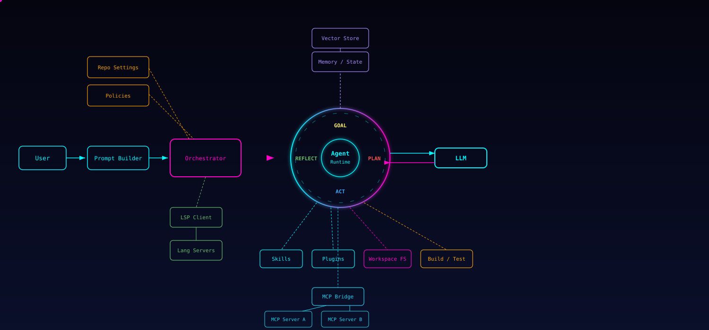

# Part 1: Why Use an AI Coding Agent CLI?

> [!NOTE]
> This part explains the concepts and tradeoffs behind AI coding agent CLIs. If you already understand the basics and want to install the recommended setup, continue with [Part 2: A default setup](part-2-default-setup.md).

## The Evolution of AI-Assisted Coding

When getting familiar with AI-assisted coding you will probably go through the following phases, and at each step your productivity can improve:

1. **Chat interface online** — Just asking questions in a web chat. No code context.
2. **Code completion in your IDE** — Inline suggestions as you type (e.g. Copilot autocompletion).
3. **Ask from within your code** — Right-click, ask. Good for small, localized updates.
4. **IDE chat panel** — Refine your question while the AI knows context about your current file. Good for changes that focus on one file.
5. **AI Agent in IDE** — A Goal → Plan → Act → Reflect loop. Good at multi-file changes while continuously reflecting on what it's doing.
6. **AI Agent CLI / Desktop** — Same loop, but unconstrained by an IDE: can run terminal commands, drive multiple repos, work in parallel, and run long autonomous tasks. This is what the rest of this guide focuses on.

Depending on your task you may want to use one or more of these in combination. For example, you can use Copilot for tight inline suggestions, but then switch to an agent CLI for a large refactor that requires planning, testing, and multiple steps and you can ask in an online chat why a specific choice made by the agent would be valid.

The important takeaway is not that each step replaces the previous one. It is that each step expands the range of tasks you can reasonably hand off.

## The Agent Loop

An AI coding agent doesn't just answer questions — it operates in a continuous loop:

This loop is what separates an agent from a simple chat — it can plan work, execute it, and evaluate the result before continuing.

## Context Is Everything

The more relevant context you give to LLMs, the better the outcome will be. But sending everything you have creates longer wait times, higher cost, and lower signal. Current models also have context limits, so you have to be deliberate about what you send:

- **Behavior context** — Let your agent select skills, or instruct it directly, to give it a behavior and work-mode context.
- **Content context** — Construct an agents.md or use a tool that creates a graph of your data to give it a content context.
- **External context** — Give your agent access to external systems (via MCP) to extend the content context.
- **Intent context** — Add an agent session memory tool to give it an intent context.
- **Irelevant context** - This is what you don't want in your context. It can influence the outcome with less optimal results. 

This is usually where the biggest practical gains come from. Better models help, but better context often helps more.

## Why Not Just Use GitHub Copilot in VS?

The Visual Studio GitHub Copilot agent is getting better and can now also use skills and MCP, but there are still some things where [OpenCode](https://github.com/anomalyco/opencode) (and other CLIs) excels.

**[OpenCode](https://github.com/anomalyco/opencode) (Desktop) benefits from:**
- terminal automation
- (multi-) repo-wide refactors
- autonomous, long-running workflows
- parallel execution of multiple agents/sessions
- swapping between LLM providers per task
- a richer add-on ecosystem (skills, plugins, MCPs) that you fully control

A realistic setup is to use **both**: GitHub Copilot in your IDE for tight inline edits, and OpenCode for everything broader (refactors, reviews, ops tasks).

### When a CLI Agent Is a Bad Fit

A CLI agent is not automatically the best choice. It is often the wrong tool when:

- the task is a tiny edit in one file that you can do faster directly in the IDE
- the cost of reviewing the agent's output is higher than writing the change yourself
- the task involves sensitive production systems that you do not want an agent touching
- the problem is still too ambiguous for autonomous execution
- you do not yet have enough repo context, tests, or guardrails to make autonomous changes safe

In those situations, inline assistance or a normal chat workflow is usually the better option.

## Why OpenCode?

We want a CLI with strong support for add-ons. There are many CLI environments available. All major LLM providers have
their own, and there are many open source CLIs as well. They work similarly enough that many add-ons are portable across them.
I chose OpenCode because:

- It's **open source**
- It supports **many LLM providers**
- It can use **most add-ons** even if they are created for other CLIs
- It has **OpenCode Desktop** which gives you advanced repository and session management

This guide uses OpenCode as the reference implementation, but most of the orchestration ideas in this document also apply to other coding-agent CLIs.

## The Landscape: Other CLIs and Autonomous Agents

There are many other open source CLIs available. The space is moving quickly, and new variants keep appearing with extra tools, skills, and workflow layers. So far it is still unclear whether any single option will clearly dominate. If you install the right add-ons yourself, there is currently not much pressure to switch constantly.

There are also autonomous agents like OpenClaw. These are not meant for coding but for 24/7 fully autonomous tasks.
They run continuously with persistent memory across sessions and integrations for messaging platforms, maintaining independent decision loops. Be aware that automated execution based on external input is a real security concern: because they run autonomously for a given task/workflow, they may try to "improve" themselves and end up doing harm instead of good. Also be aware that with the right combination of MCPs, skills, and scheduling you can get close to similar functionality from a CLI agent — the main difference being that it won't be *fully* autonomous.

## How to Improve Your Agent's Results

Using an LLM Coding Agent CLI is still not perfect but you can improve the outcome by tweaking all steps that these coding agents make:

Here's what you can tune at each layer:

### Prompt

The prompt is where everything starts. If you ask a vague question, the agent will often make assumptions, choose the wrong scope, or move too quickly into implementation. A much better pattern is to begin with problem framing: paste the Jira ticket, issue, or rough requirement and ask the agent to restate the task, list assumptions, identify unknowns, and suggest a plan before it writes code.

This works because prompt quality is not just about wording, but about giving the model the right level of direction. Good prompts define the goal, the constraints, the expected output, and the level of autonomy you want. In practice, this is a skill you improve over time by experimenting with different prompt styles and noticing which ones produce the best planning and the fewest corrections.

As a rule, the less obvious the task is, the more useful it is to ask for restatement, assumptions, and a plan before execution.

### LSP

Language Server Protocol support improves how well the agent understands your codebase. LSPs provide structural information such as symbols, definitions, references, diagnostics, and type information, which is much more useful than plain text search. That means the agent can navigate code more accurately and make changes with better awareness of how pieces fit together.

Many LSPs are bundled by default for common languages such as C# and TypeScript. The instructions below add one for MS SQL as well. In general, the more complete your LSP support is, the better your agent can inspect the code, follow dependencies, and avoid low-confidence edits.

### Agent / Plugin

Plugins and agent extensions shape how the agent behaves during its Goal → Plan → Act → Reflect loop. They use event hooks to run scripts or code at specific moments, and they can be enabled by default, triggered through a skill, or exposed as a selectable agent profile. This gives you a way to steer not only what the agent knows, but also how it works.

The `oh-my-opencode` and `planning-with-files` add-ons mentioned below are good examples. They make the workflow more explicit and give you more control over planning and execution. Similar features are gradually being absorbed into the CLI itself, but these extensions still add real value today.

For improving the context (adding relevant, removing irrelevant) we will install the plugins `graphify`, `mempalace` and `context-optimizer`

### MCP

Model Context Protocol is how you connect the agent to systems outside the repository. Instead of limiting the agent to local files, MCP lets it retrieve or update information in tools such as SQL Server, Azure, Azure DevOps, Jira, and many others. That makes the agent much more useful for real work, because most engineering tasks depend on context that lives outside the codebase.

Used well, MCP turns the agent from a code editor into a workflow participant. It can inspect tickets, read docs, query data, or interact with operational systems while staying inside one task flow. See [Awesome MCP](https://github.com/wong2/awesome-mcp-servers) for inspiration and examples.

Used badly, MCP just gives the agent more ways to make mistakes. That is why verification and permission boundaries matter as much as raw tool access.

### Repo settings

Repository-level settings give the agent durable context about how your project works. Running `/init` generates an `Agents.md` file that you can customize with architecture notes, conventions, workflows, and other repo-specific knowledge. This helps the agent make better decisions without needing you to repeat the same instructions in every session.

It is also worth linking Visual Studio's GitHub Copilot to the same `Agents.md`, so the knowledge is reused both inside the IDE and in your CLI agent. If you commit that file, the whole team shares one source of truth. A richer alternative is a graph-based context tool such as Graphify (see Step 4.2).

### Skills

Skills are reusable, higher-level instructions for recurring workflows. You can use a large catalog of standard skills, fine-tune them through repo settings, or create custom ones for tasks that come up often in your team. They are especially useful when the challenge is not only understanding code, but also understanding intent and following a repeatable process.

Unlike a one-off prompt, a skill can encode a workflow pattern. Some skills can even call other skills in sequence or in parallel, and they may ask the user clarifying questions when needed. Beyond the skills installed below, many more are catalogued at [skills.sh](https://skills.sh).

### Tools

Tools extend what the agent can actually do. A tool might automate documentation conversion, generate a PowerPoint deck, run a specialized command-line workflow, or perform another concrete task that is awkward to express through prompting alone. In other words, tools give the agent execution capabilities instead of just reasoning capabilities.

These tools often work best when paired with a companion skill or MCP server, so the agent not only has access to the capability but also understands when and how to use it. Examples in the instructions below include MarkItDown, PPT-Master, and CLI-Anything.

### LLM

The underlying model still matters. Different LLMs vary in reasoning depth, coding speed, tool use, context handling, and reliability, so it is worth choosing the right model for the task instead of treating them as interchangeable. As of writing, Anthropic's *Claude Opus / Sonnet* family tends to lead on reasoning and OpenAI's *GPT-5* family tends to lead on coding throughput, but this changes quickly.

Because the landscape moves so fast, model choice should be revisited regularly. Follow benchmarks such as [livebench](https://livebench.ai/#/?highunseenbias=true), and [Artificial Analysis](https://artificialanalysis.ai/leaderboards/models) to see when something better lands.
Other benchmarks that does not seems to be up to date but still worth checking are [LLM Stats](https://llm-stats.com/), [SWE-bench](https://www.swebench.com/), [benchlm.ai](https://benchlm.ai/), [lm-arena](https://huggingface.co/spaces/lmarena-ai/arena-leaderboard), 

If your tool supports routing, you do not need one perfect model. You need a reasonable model for planning, a fast model for execution, and a reliable model for verification.

### Context optimisation
You could add to your context so that your agent will have the right awnser faster using plugins like [Graphify](https://github.com/safishamsi/graphify) and [Mempalace](https://github.com/MemPalace/mempalace),
Stop adding irrelevant information to the context and keep your context clean with [context-mode](https://github.com/mksglu/context-mode), 
Dedupe, Rerank and Compress the context before sending it to the LLM with [context-optimizer](https://github.com/evermeer/context-optimizer)
and ask your agent to resond with a compact response with [Caveman](https://github.com/JuliusBrussee/caveman)

---

> [!NOTE]
> Continue with [Part 2: A default setup](part-2-default-setup.md).
