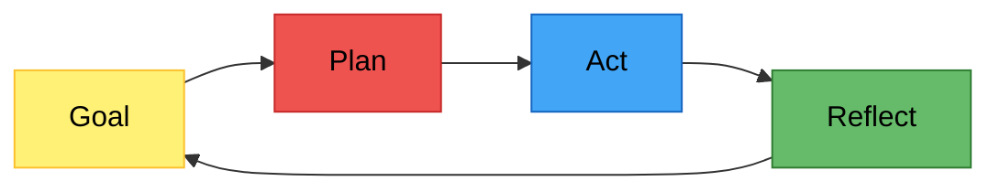
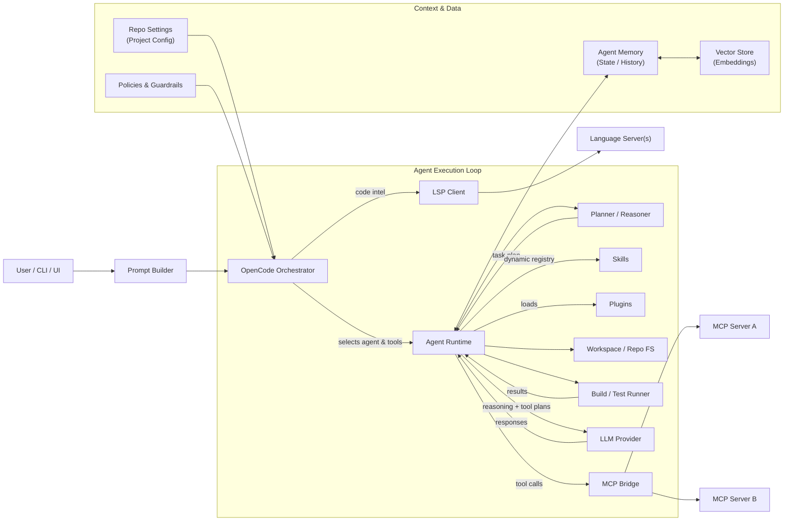

# Part 1: Why Use an AI Coding Agent CLI?

> [!NOTE]
> This part explains the concepts and tradeoffs behind AI coding agent CLIs. If you already understand the basics and want to install the recommended setup, continue with [Part 2: A default setup](part-2-default-setup.md).

## The Evolution of AI-Assisted Coding

When getting familiar with AI-assisted coding you will probably go through the following phases, and at each step your productivity can improve:

1. **Chat interface online** — Just asking questions in a web chat. No code context.
2. **Code completion in your IDE** — Inline suggestions as you type (e.g. Copilot autocompletion).
3. **Ask from within your code** — Right-click, ask. Good for small, localized updates.
4. **IDE chat panel** — Refine your question while the AI knows context about your current file. Good for changes that focus on one file.
5. **AI Agent in IDE** — A Goal → Plan → Act → Reflect loop. Good at multi-file changes while continuously reflecting on what it's doing.
6. **AI Agent CLI / Desktop** — Same loop, but unconstrained by an IDE: can run terminal commands, drive multiple repos, work in parallel, and run long autonomous tasks. This is what the rest of this guide focuses on.

## The Agent Loop

An AI coding agent doesn't just answer questions — it operates in a continuous loop:

This loop is what separates an agent from a simple chat — it can plan work, execute it, and evaluate the result before continuing.

## Context Is Everything

The more relevant context you give to LLM models, the better the outcome will be. But giving them everything you have can create long wait times and unnecessary costs. You have to solve this by optimizing what you send to the LLM:

- **Behavior context** — Let your agent select skills, or instruct it directly, to give it a behavior and work-mode context.
- **Content context** — Construct an agents.md or use a tool that creates a graph of your data to give it a content context.
- **External context** — Give your agent access to external systems (via MCP) to extend the content context.
- **Intent context** — Add an agent session memory tool to give it an intent context.

## Why Not Just Use GitHub Copilot in VS?

The Visual Studio GitHub Copilot agent is getting better and can now also use skills and MCP, but there are still some things where OpenCode (and other CLIs) excels.

**OpenCode (Desktop) benefits from:**
- terminal automation
- (multi-) repo-wide refactors
- autonomous, long-running workflows
- parallel execution of multiple agents/sessions
- swapping between LLM providers per task
- a richer add-on ecosystem (skills, plugins, MCPs) that you fully control

A realistic setup is to use **both**: GitHub Copilot in your IDE for tight inline edits, and OpenCode for everything broader (refactors, reviews, ops tasks).

## Why OpenCode?

We want a CLI with great support for add-ons. There are many CLI environments available. All major LLM providers have 
their own and there are a lot of open source CLIs. They all work very similar and most available add-ons are compatible. 
I chose OpenCode because:

- It's **open source**
- It supports **many LLM providers**
- It can use **most add-ons** even if they are created for other CLIs
- It has **OpenCode Desktop** which gives you advanced repository and session management

## The Landscape: Other CLIs and Autonomous Agents

There are many other open source CLIs available. Now that Anthropic's CLI code is leaked many new CLIs are popping up in 
all kinds of variations with added tools, skills and other functionality. So far it's still unclear if any of these will 
pop out as superior. If you install the right add-ons yourself then for now there is not much need to try these.

There are also autonomous agents like OpenClaw.  These are not meant for coding but for 24/7 fully autonomous tasks.
They run continuously with persistent memory across sessions and integrations for messaging platforms, maintaining independent decision loops. Be aware that automated execution based on external input is a real security concern: because they run autonomously for a given task/workflow, they may try to "improve" themselves and end up doing harm instead of good. Also be aware that with the right combination of MCPs, skills, and scheduling you can get close to similar functionality from a CLI agent — the main difference being that it won't be *fully* autonomous.

## How to Improve Your Agent's Results

Using an LLM Coding Agent CLI is still not perfect but you can improve the outcome by tweaking all steps that these coding agents make:

Here's what you can tune at each layer:

- **Prompt** — Ask the right question. For example, when starting from a Jira ticket, paste the ticket text and ask the agent to *refine* it before doing anything. The more context you give, the better the result. Before instructing your agent to implement something, first ask it to restate the task and list its assumptions — then correct it. You just need to practice and experiment.
- **LSP** — Many Language Server Protocols are bundled by default (C#, TypeScript, etc.). The instructions below add one for MS SQL.
- **Agent / Plugin** — `oh-my-opencode` and `planning-with-files` give you more control and a better agent loop. Similar functionality is slowly being absorbed into the CLI itself, but for now these still add real value.
- **MCP** — Use the Model Context Protocol to let your agent talk to external systems: SQL Server, Azure, Azure DevOps, Jira, etc. (see instructions below). See [Awesome MCP](https://github.com/wong2/awesome-mcp-servers) for inspiration.
- **Repo settings** — Run `/init` and customize the generated `Agents.md` with info about your repo. It acts as a knowledge base for skills and general context. Tell OpenCode to also link Visual Studio's GitHub Copilot to this `Agents.md` so the same knowledge is reused inside the IDE. Commit it so the whole team shares one source of truth. A richer alternative is a tool like Graphify (see Step 4.2).
- **Skills** — Use a wide collection of standard skills (which you can fine-tune via repo settings) or create custom skills for recurring workflows. Beyond the skills installed below, more are catalogued at [skills.sh](https://skills.sh). Skills can start other skills (even in parallel) and can ask the user questions. They are great for specifying *intent*.
- **LLM** — Use the latest model. As of writing, Anthropic's *Claude Opus / Sonnet* family tends to lead on reasoning and OpenAI's *GPT-5* family tends to lead on coding throughput, but this changes monthly.  Follow benchmarks (e.g. [LLM Stats](https://llm-stats.com/), [SWE-bench](https://www.swebench.com/), [benchlm.ai](https://benchlm.ai/), [lm-arena](https://huggingface.co/spaces/lmarena-ai/arena-leaderboard), [livebench](https://livebench.ai/#/?highunseenbias=true), [Artificial Analysis](https://artificialanalysis.ai/leaderboards/models)) to see when something better lands.

## Other Options to Investigate

On GitHub I maintain a list of interesting AI tools: [My list of AI tools](https://github.com/stars/evermeer/lists/ai)

Here is my top list of tools I would like to investigate and which are not (yet) in the instructions below:

**Agent / orchestration**
- [serena](https://github.com/oraios/serena) — semantic code retrieval, editing and refactoring tools (LSP-aware), often dramatically reduces token usage on large repos.
- [archon](https://github.com/coleam00/Archon) — workflow engine. Instead of one skill doing multiple steps, define a workflow of tasks each using its own steps/skills. Use this when a task is open-ended, uncertain, or long-running.
- [superset](https://github.com/superset-sh/superset) — for AI agent swarm orchestration. 
- [aider](https://aider.chat) — alternative coding CLI worth knowing; very strong git integration and a useful benchmark leaderboard even if you don't switch.

**Context & memory**
- [repomix](https://github.com/yamadashy/repomix) — packs an entire repo (or a filtered subset) into a single LLM-friendly file; handy for one-shot "explain this codebase" prompts.
- [Pieces](https://pieces.app) — long-term developer memory across IDEs, browsers and terminals; alternative angle on what MemPalace does.

**External system MCPs**
- [github-mcp-server](https://github.com/github/github-mcp-server) — official GitHub MCP for issues, PRs, code search and reviews from the agent.
- [playwright-mcp](https://github.com/microsoft/playwright-mcp) — drive a real browser from the agent for end-to-end test authoring and UI verification.
- [firebase-mcp](https://lobehub.com/nl/mcp/firebase-mcp-firebase-mcp-server) — read static and runtime information from Firebase projects.
- [notion-mcp](https://github.com/makenotion/notion-mcp-server) — pull documentation/specs from Notion into agent context.
- [slack-mcp](https://github.com/korotovsky/slack-mcp-server) — read and send messages to Slack channels from your agent.
- [filesystem / desktop-commander MCPs](https://github.com/wonderwhy-er/DesktopCommanderMCP) — give the agent controlled shell + filesystem access outside the repo (e.g. for ops scripts).
- [sequential-thinking MCP](https://github.com/modelcontextprotocol/servers/tree/main/src/sequentialthinking) — gives the model an explicit scratchpad for multi-step reasoning; helps on hard refactors.

**Cost, routing, observability**
- [ccusage](https://github.com/ryoppippi/ccusage) — token / cost dashboards for Claude-style CLIs; the same pattern is useful for monitoring OpenCode spend.
