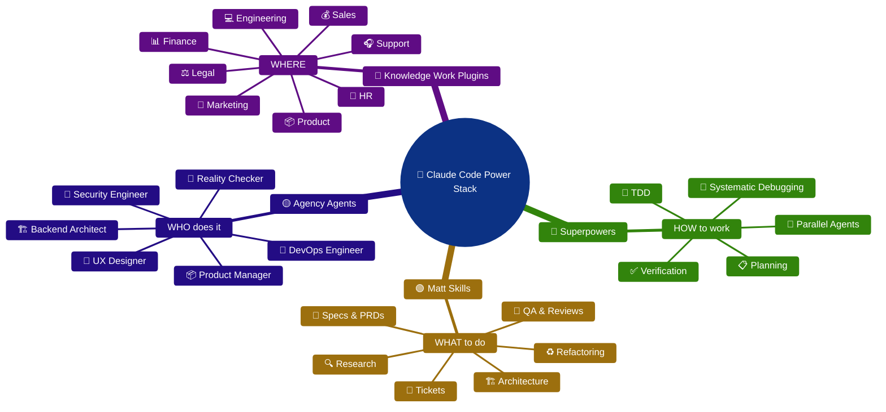
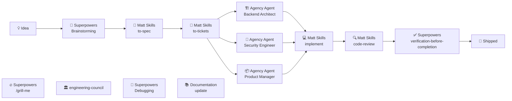

# Part 2: How to Use an AI Coding Agent

> [!NOTE]
> This part builds on [Part 1: Why Use an AI Coding Agent CLI?](part-1-why-use-an-ai-coding-agent-cli.md). It shows how the skill packs complement each other and how to run them as a daily workflow. When you are ready to install everything, continue with [Part 3: A default setup](part-3-default-setup.md).

## Skill pack combination power

The folowing 4 skill packs only have limited overlap and work great together. 
Besides the mentioned steps in the workflow below, the skill packs also have a lot of other skills that you can use in your daily workflow. 
Here is a mindmap of what you can finde in them:



### Overlap between skill packs

|                | Superpowers | Matt Skills | Agency Agents | Knowledge Work |
| -------------- | ----------- | ----------- | ------------- | -------------- |
| Superpowers    | -           | Medium      | Low           | Very Low       |
| Matt Skills    | Medium      | -           | Low           | Low            |
| Agency Agents  | Low         | Low         | -             | Medium         |
| Knowledge Work | Very Low    | Low         | Medium        | -              |


## Your workflow

Above mentioned skill packs each aim at a different area (What / How / Who / Where) that only have limited overlap and work great togather in a daily workflow. 
The skill packs are: [Superpowers](https://github.com/obra/superpowers), [Skills for real engineers](https://github.com/mattpocock/skills), [Agency Agents](https://github.com/msitarzewski/agency-agents-app) and [Knowledge Work](https://github.com/anthropics/knowledge-work-plugins)

Here is a diagram of how these skill packs work together in a daily workflow. You can use the complete flow or cherry pick individual steps.



Below is a step-by-step walkthrough of the workflow diagram above. For each step you'll find **when** to reach for it, **how** to execute it, and a concrete **example**. The example is a single running scenario so you can see the whole flow end to end: *extracting the Billing functional area out of a monolithic solution into a separate Billing service.* You can run the complete flow or cherry-pick individual steps.

In the sample prompts i reference markown files, but you can use any other format you prefer (Jira ticket, Slack thread, etc.).

After each prompt you should review the output and ask clarifying questions or ask for changes.

I used this workflow to creat the game Quadrim (available on iOS and Android soon).
It's a strategy game (3d 4 in a row) with multiple opponents, ELO rating and saving points for unlocking opponents, apps store products.
The total took me about 4 weeks (spare time, evenings and weekends) from idea to app stores.
It's about 30K pure lines of code and 15K of markdown files plus 15k of data and asset files.

#### 💡 Idea — Capture the requirement or opportunity

**When:** At the very start, when you have a problem, opportunity, or rough requirement but no defined scope yet. This is the moment before you commit to a solution.

**How:** Capture the idea in plain language. Don't ask for code yet; the goal is only to record the intent and the "why" so later steps have something to refine. Put that idea in a markdown file in jour repository at doc/idea-v0.md

**Example:** You notice that billing logic is scattered across the monolith and slows down every release. You capture it as: *"Billing is tightly coupled to the monolith. We want to extract it into its own service so it can be deployed, scaled, and owned independently."*

**Prompt:**
```text
Here's a rough idea in the file doc/idea-v0.md. Restate the
goal, list the assumptions and unknowns, and don't write any code yet. Ask me
any clarifying questions you need until the goal and constraints are
unambiguous before you summarize. The goal is to have a clear and unambiguous 
understanding of the idea and its requirements before starting to write code.
Put all decisions in the file doc/idea-v0-decisions.md and put the result in 
the file doc/idea-v1.md
```

#### 🧠 Superpowers · Brainstorming — Explore the problem space

**When:** After capturing the idea, while the approach is still open. Use it when there are multiple viable directions or unknowns you want surfaced before committing.

**How:** Ask the Superpowers *brainstorming* skill to restate the problem, list assumptions, identify unknowns, and propose several options with trade-offs. Push back on its suggestions and let it challenge yours — the output is a shared understanding, not code.

**Example:** The brainstorm surfaces options for the extraction: strangler-fig pattern vs. a big-bang rewrite, how to handle the shared customer table, whether to keep a synchronous call or move to events, and what the rollback story looks like. You settle on an incremental strangler-fig approach with an anti-corruption layer.

**Prompt:**
```text
Use the Superpowers brainstorming skill on the created file doc/idea-v1.md. 
Propose several approaches. Ask clarifying questions about the setup, functionality, design and
constraints before proposing options if anything is unclear.
Put the results in the file doc/idea-v1-brainstorming.md
Add all decisions to the file doc/idea-v1-decisions.md
```

#### 📝 Matt Skills · to-spec — Turn the idea into a spec

**When:** Once you've chosen a direction and need to make it precise and reviewable before breaking it into work.

**How:** Run the *to-spec* skill to convert the brainstorm into a structured spec/PRD: goal, scope, non-goals, constraints, interfaces, data ownership, and acceptance criteria. Review it and correct anything the agent assumed.

**Example:** The spec defines the new Billing service boundary: which endpoints it exposes, that it owns the `invoices` and `payments` tables, that the monolith talks to it through an anti-corruption layer, and the acceptance criteria (existing billing flows keep working, no data loss, feature-flagged cutover).

Since the brainstorming proposed multiple approaches, for this idea we should follow the recommended strategy A from the brainstorming document.

**Prompt:**
```text
Use the Matt Skills to-spec skill to turn the doc/idea-v1.md plus the 
doc/idea-v1-brainstorming.md and doc/idea-v1-decisions.md
into a spec for the idea: goal, scope, non-goals, exposed endpoints, data and
acceptance criteria. Ask clarifying questions and don't finalize the spec until
any ambiguities are resolved. Put the result in the file doc/idea-v1-spec.md
Add all decisions to the file doc/idea-v1-decisions.md

Follow recomended strategy A from the brainstorming document.
```

#### 🎫 Matt Skills · to-tickets — Decompose into deliverable tasks

**When:** After the spec is agreed, when the work is too large to implement in one pass and needs to be split into independently shippable pieces.

**How:** Run the *to-tickets* skill to break the spec into small, ordered tickets with clear dependencies and acceptance criteria. Sequence them so each can be built, tested, and merged on its own.

**Example:** The spec becomes tickets such as: (1) scaffold the Billing service, (2) move the billing domain model, (3) add the anti-corruption layer in the monolith, (4) migrate the `invoices`/`payments` tables, (5) route billing calls through a feature flag, (6) remove the old code path.

**Prompt:**
```text
Use the Matt Skills to-tickets skill to break the doc/idea-v1-spec.md into
small, independently shippable tickets with dependencies and acceptance
criteria, ordered so each can be built, tested, and merged on its own. Ask
clarifying questions about scope or dependencies before finalizing the
breakdown. Store all tickets as a markdown file in the ./doc/tickets folder, 
with a name that starts with the ticket number and a dash, followed by a short 
description of the ticket. For example, 001-setup-project.md. Put the result in 
the ./doc/tickets folder. Add all decisions to the file doc/idea-v1-decisions.md
```

#### 👥 Agency Agents · Specialists — Validate the approach

**When:** Before implementation, when the change touches architecture, security, or product concerns and you want expert perspectives to catch problems early.

**How:** Route the spec and tickets through the relevant Agency Agents — *Backend Architect*, *Security Engineer*, *Product Manager* (and UX where relevant). Each reviews from its angle and returns concerns and recommendations that feed back into the spec or tickets.

**Example:** The **Backend Architect** flags that the shared customer table needs a clear owner and suggests eventual consistency for read models. The **Security Engineer** requires service-to-service authentication and that payment data stays encrypted in transit and at rest. The **Product Manager** confirms the cutover must be invisible to customers and asks for a phased rollout.

**Prompt:**
```text
Review the doc/idea-v1-spec.md and the tickets in the ./doc/tickets folder with the Agency Agents
backend-architect, security-engineer, and product-manager. Have each agent ask
clarifying questions where context is missing before giving their concerns.
Return each agent's concerns and recommendations so I can fold them back into
the spec and tickets. write the concerns and recommendations in the file doc/idea-v1-spec-review.md
Add all decisions to the file doc/idea-v1-decisions.md
```

Don't forget to review the output and ask clarifying questions or ask for changes.

If you have changed a lot, then ask for a new review.

#### 💻 Matt Skills · implement — Build incrementally

**When:** Once tickets are validated and ready. Use it per ticket, not for the whole epic at once.

**How:** Run the *implement* skill on one ticket at a time, ideally test-first. Let the agent plan, write tests, implement, and run them, then review the diff before moving to the next ticket.

**Example:** For the anti-corruption-layer ticket, the agent writes tests describing how the monolith should call the Billing service, implements the adapter behind the feature flag, and confirms the existing billing tests still pass before you move on to the data migration ticket.

**Prompt:**
```text
Now that the spec and tickets are finalized, start implementing the idea according to the tickets in the ./doc/tickets folder.
The goal is to have a working first version of the idea that can be tested.
Ask clarifying questions if anything is unclear and add the decisions to the file doc/idea-v1-decisions.md
After each ticket run the skill code-review-expert 
Commit and push the code to the main branch after each ticket is completed and reviewed.
```

#### 🔍 Matt Skills · code-review — Review before verification

**When:** After a ticket (or a batch of related tickets) is implemented, before you declare it done.

**How:** Run the *code-review* skill against the branch/diff. It checks for correctness, security, performance, and convention issues, and proposes concrete fixes. Address the findings, then re-review if needed.

**Example:** The review notices the anti-corruption layer swallows a downstream timeout instead of surfacing it, and that a new endpoint is missing authorization. You fix both and re-run the review until it's clean.

**Prompt:**
```text
Use the Matt Skills code-review skill on the idea. Check
correctness, security, performance, and conventions, and list concrete fixes
(e.g. error handling and authorization on the new endpoints).
```

#### ✅ Superpowers · verification-before-completion — Prove it's done

**When:** As the final gate before shipping, when the code passes review but you still need to prove the behaviour is correct and complete.

**How:** Run the Superpowers *verification-before-completion* skill to validate against the acceptance criteria: run the full test suite, exercise the real flows, and challenge the assumption that it's finished. Only proceed when the evidence backs it up.

**Example:** Verification runs the end-to-end billing scenarios through the new service with the feature flag on, confirms invoices and payments match the monolith's previous behaviour, checks that rollback (flag off) still works, and validates no data was lost during migration.

**Prompt:**
```text
Use the Superpowers verification-before-completion skill on the idea. 
Run the full test suite, exercise the end-to-end flows, 
confirm no data loss on migration, and verify every
acceptance criterion before calling it done.
```

#### 🚢 Shipped — Release, monitor, learn

**When:** After verification passes and the acceptance criteria are met.

**How:** Release the change (typically behind the feature flag first), monitor it in production, capture what you learned, and feed the next iteration back into the 💡 Idea step.

**Example:** You enable the Billing service for a small percentage of traffic, watch error rates and latency, then roll it out fully and delete the old monolith billing code. The lessons learned (e.g. the shared-table ownership pain) become the next idea to tackle.

**Prompt:**
```text
Help me ship the idea: draft the phased rollout plan (feature flag
from a small percentage of traffic to full), list the error-rate and latency
metrics to watch, and outline the cleanup to remove the old monolith billing
code once it's stable. Ask clarifying questions about our environments and
rollout constraints before drafting the plan.
```

## Optional workflow steps

The steps above form the core end-to-end flow. The steps below are optional add-ons you can slot in wherever they help. They are not part of every run — reach for them when the situation calls for it. Keep the ones that fit your workflow and ignore the rest.

#### 🔥 Matt's · /grill-me — Stress-test your thinking

**When:** Before committing to an idea, spec, or plan, when you want your assumptions challenged rather than confirmed. Best used right after the 💡 Idea or 📝 to-spec step, or before a big architectural decision.

**How:** Run Matt's *grill-me* skill and let it interrogate your reasoning with tough, Socratic questions — edge cases, hidden assumptions, failure modes, and "what would have to be true" checks. Answer honestly and fold the gaps it exposes back into your spec or plan.

**Example:** Before extracting Billing, grill-me pushes on questions like *"What happens to in-flight invoices during cutover?"*, *"How do you roll back once the monolith stops owning the payments table?"*, and *"What's your consistency guarantee for the shared customer data?"* — surfacing two gaps you hadn't scoped.

**Prompt:**
```text
Use Matt's grill-me skill on my idea. 
Challenge my assumptions, probe the edge cases and failure modes
(cutover, rollback, shared data consistency), and tell me what would have to be
true for this to work. Don't let me off the hook easily.
```

#### 🏛️ custom . engineering-council — Multi-perspective engineering review

**When:** For non-trivial decisions — a bug, feature, PR, architecture choice, or implementation plan — where a single viewpoint isn't enough and you want several independent engineering perspectives before you decide.

**How:** Run the (custom) *engineering-council* skill on the issue or plan. It analyses the problem through multiple independent engineering lenses and then reconciles them into a single unified recommendation, so you get both the diversity of opinions and a clear call to action.

**Example:** You feed the council your strangler-fig extraction plan. One perspective favours events for decoupling, another warns about the operational cost of a message broker, a third prioritises a fast reversible cutover. The council weighs the trade-offs and recommends starting synchronous behind the anti-corruption layer, with events as a later step.

**Prompt:**
```text
Use the engineering-council skill on my idea. 
Analyse it from multiple independent engineering perspectives
(architecture, security, performance, skeptical, ...), then reconcile 
them into a single unified recommendation with the key trade-offs called out.
```

#### 🐛 Superpowers · Debugging — Find the real root cause

**When:** Mid-implementation, when something breaks and the cause isn't obvious. Use it instead of guessing or patching symptoms.

**How:** Run the Superpowers *debugging* / root-cause skill. It reproduces the failure, isolates the smallest failing case, forms and tests hypotheses, and traces the problem to its actual source before proposing a fix.

**Example:** The anti-corruption layer intermittently drops a payment update. Instead of adding retries blindly, the skill traces it to a race between the feature-flag check and the cache invalidation, and fixes the ordering.

**Prompt:**
```text
Use the Superpowers debugging skill on the intermittent dropped-payment bug in
the anti-corruption layer. Reproduce it, isolate the smallest failing case, form
and test hypotheses, and trace it to the real root cause before proposing a fix.
```

#### 📚 Documentation update — Capture what changed

**When:** After a ticket or feature ships, when the change affects APIs, runbooks, onboarding, or architecture docs that others rely on.

**How:** Ask the agent to update the relevant documentation from the shipped diff — READMEs, API references, ADRs, and runbooks — so the docs match reality while the context is still fresh.

**Example:** After the Billing cutover you regenerate the service README, add an ADR recording the strangler-fig decision, and update the on-call runbook with the new rollback (flag-off) procedure.

**Prompt:**
```text
Update the documentation for the newly extracted Billing service based on the
merged changes: refresh the service README and API reference, add an ADR for the
strangler-fig decision, and update the on-call runbook with the feature-flag
rollback procedure.
```

---

> [!NOTE]
> Previous: [Part 1: Why Use an AI Coding Agent CLI?](part-1-why-use-an-ai-coding-agent-cli.md)  
> Continue with [Part 3: A default setup](part-3-default-setup.md).
